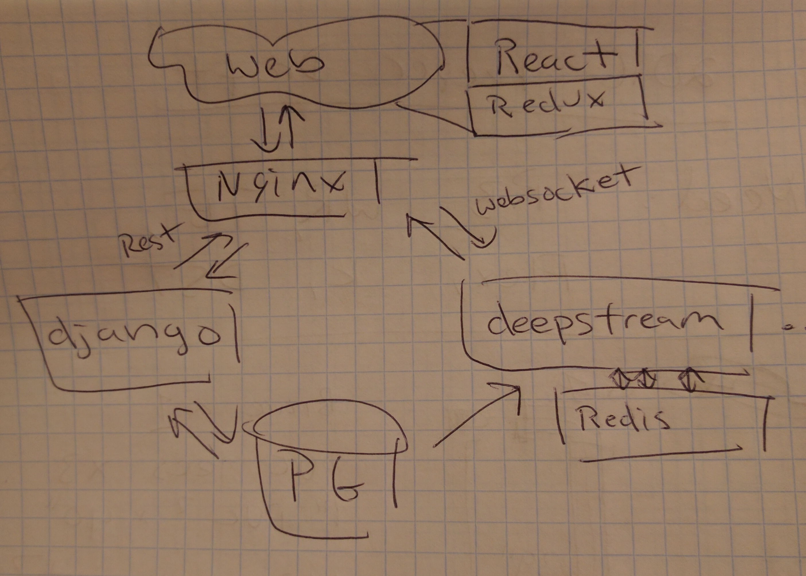

# dailyrippl

throwing smooth washed pebbles / as far as I can

## dev setup

in a separate directory
```
git clone https://github.com/unitedstates/congress-legislators
```

in here
```
pip install -r requirements.txt
python rippl/manage.py migrate
python rippl/manage.py import_reps <path to legislators-current.yaml>

npm install
brunch build # can use brunch watch for live reloading

python rippl/manage.py runserver
```

## running tests

```
tox
```

## architecture

Probably something like this



[Django for web](https://docs.djangoproject.com)

[Deepstream for realtime](https://deepstream.io)

[PostgreSQL for DB](https://www.postgresql.org/)
